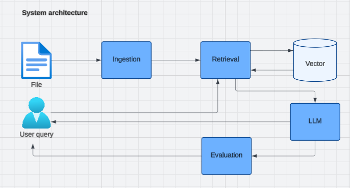
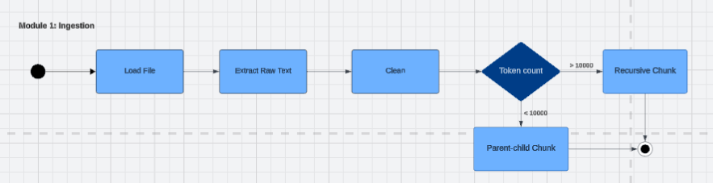
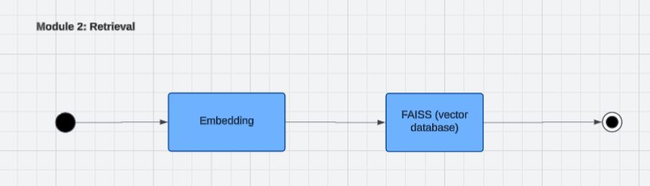
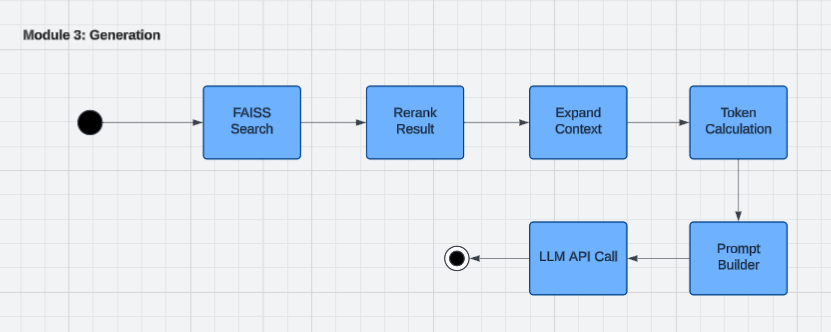
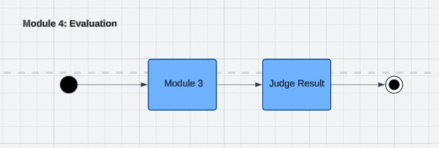
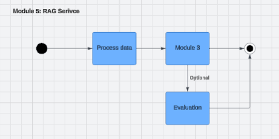

# Advanced RAG System

A production-oriented Retrieval-Augmented Generation (RAG) system built from scratch with document ingestion, FAISS retrieval, Cross-Encoder reranking, context management, LLM evaluation, and a Gradio UI.

🔗 **[Demo]** *(assets/demo.gif)*
🔗 **[Live]** *(https://huggingface.co/spaces/anhtuan2602/RAG-demo?logs=container)*

---

## Problem Statement

[Standard RAG systems often suffer from several practical limitations when applied to real-world documents.

First, vector similarity search alone frequently retrieves partially relevant chunks, causing irrelevant context to be passed into the language model. This reduces answer quality and increases hallucination risk.

Second, large documents can easily exceed the model context window, making it necessary to carefully select and prioritize retrieved information rather than blindly concatenating chunks.

Third, answer quality is often evaluated manually, making it difficult to compare retrieval strategies or monitor system performance over time.

This project addresses these challenges through a multi-stage retrieval pipeline consisting of semantic search, Cross-Encoder reranking, parent-child context expansion, token budget management, and an LLM-as-a-Judge evaluation framework for automated quality assessment.]

---

## Features

- PDF document ingestion
- Recursive and Parent-Child chunking strategies
- SentenceTransformer embeddings
- FAISS vector search
- Cross-Encoder reranking
- Context window / token budget management
- Prompt engineering for grounded generation
- Gemini integration
- LLM-as-a-Judge evaluation (Relevance, Faithfulness, Completeness)
- Gradio web interface
- Query logging and analytics support

---

## System Architecture



```
PDF
│
├── Document Loading
├── Text Cleaning
├── Chunking
│   ├── Recursive Chunking
│   └── Parent-Child Chunking
│
├── Embedding
│
├── FAISS Index
│
└── Retrieval Pipeline
    │
    ├── Semantic Search
    ├── Cross-Encoder Rerank
    ├── Context Expansion
    ├── Token Budget Control
    ├── Prompt Builder
    └── Gemini Generation
            │
            ▼
         Answer
            │
            ▼
    LLM-as-Judge Evaluation
```

---

## Project Structure







```
multi-llm-rag/
│
├── ingestion/
│   ├── loader.py
│   ├── cleaner.py
│   ├── chunker.py
│   ├── parent_child.py
│   └── pipeline.py
│
├── retrieval/
│   ├── embedder.py
│   ├── retriever.py
│   └── pipeline.py
│
├── generation/
│   ├── context_manager.py
│   ├── prompt_builder.py
│   ├── llm_router.py
│   └── pipeline.py
│
├── evaluation/
│   ├── judge.py
│   └── batch_evaluation.py
│
├── app/
│   └── rag_service.py
│
├── ui/
│   └── gradio_app.py
│
└── requirements.txt
```

---

## Retrieval Pipeline

### Stage 1 — Retrieval
- SentenceTransformer embeddings
- FAISS similarity search
- Top-K candidate retrieval

### Stage 2 — Reranking

```
Query + Chunk
        ↓
Cross Encoder
        ↓
Relevance Score
```

Only the highest quality chunks are passed to the LLM.

### Stage 3 — Context Construction
- Parent context expansion
- Duplicate removal
- Token budget control
- Conversation history management

---

## Evaluation Pipeline

The system supports LLM-as-a-Judge evaluation.

**Metrics:**
- Relevance (0–5)
- Faithfulness (0–5)
- Completeness (0–5)

Evaluation is performed using a separate judge prompt and structured JSON output.

### Example

**Question:**
```
What is the Transformer architecture?
```

**Answer:**
```
Transformer is a sequence transduction model based entirely on attention mechanisms...
```

**Evaluation:**
```json
{
  "relevance": 5,
  "faithfulness": 5,
  "completeness": 5
}
```

---

## Results

Evaluated on **[ TODO: N ]** QA pairs generated from **[ TODO: describe your test document set ]**.

| Configuration              | Relevance (avg) | Faithfulness (avg) | Completeness (avg) | Avg Latency |
|-----------------------------|------------------|----------------------|----------------------|-------------|
| Baseline (no rerank)        | [ TODO ]         | [ TODO ]             | [ TODO ]             | [ TODO ]    |
| With Cross-Encoder Rerank   | [ TODO ]         | [ TODO ]             | [ TODO ]             | [ TODO ]    |

[ TODO: 1-2 sentence takeaway, e.g. "Reranking improved faithfulness by X% at the cost of Yms additional latency." ]

---

## Running Locally

### 1. Clone & Install
```bash
git clone https://github.com/[ TODO: your-username ]/multi-llm-rag.git
cd multi-llm-rag
pip install -r requirements.txt
```

### 2. Configure environment variables
```bash
cp .env.example .env
# Edit .env and add your GEMINI_API_KEY
```

### 3. Ingest your documents
```bash
python -m ingestion.pipeline --input ./data/[ TODO: your_docs_folder ]/
```

### 4. Launch the UI
```bash
python -m ui.gradio_app
```
Then visit `http://localhost:7860`

---

## Tech Stack

- Python [ TODO: 3.10+ ]
- Gradio
- FAISS
- SentenceTransformers
- CrossEncoder
- Gemini API
- NumPy
- PyMuPDF

---

## Limitations

* Currently supports single-document sessions; uploaded documents replace the existing index.
* Retrieval relies on dense vector search only; BM25 hybrid retrieval is not yet implemented.
* Evaluation scores are generated by an LLM judge and may not perfectly correlate with human evaluation.
* Conversation history is stored in memory and is not persisted across sessions.


---

## Future Improvements

- Hybrid Search (BM25 + FAISS)
- Query Reformulation
- Multi-document Management
- Analytics Dashboard
- Session-based Retrieval

---

## License

MIT License — see [LICENSE](LICENSE) file for details.

---

## Author

Le Quang Anh Tuan

Software Engineering Graduate  
Interested in LLM Systems, RAG, NLP, and AI Engineering
